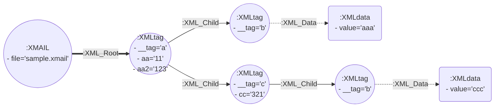
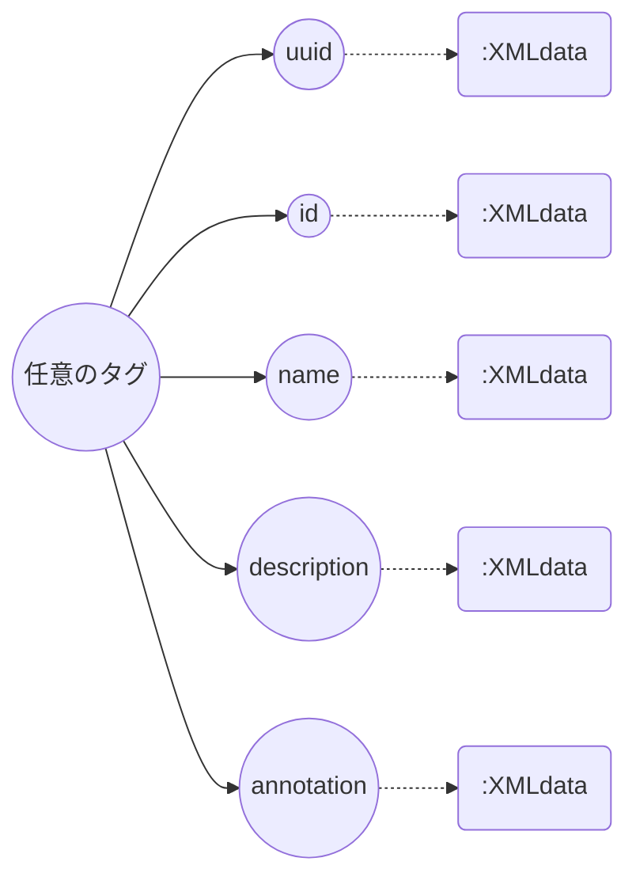
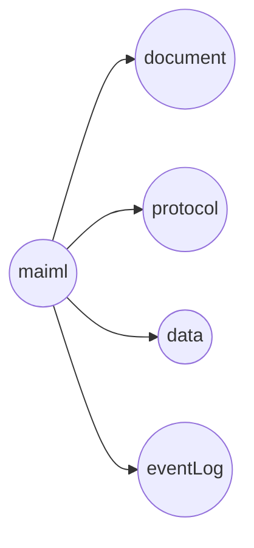
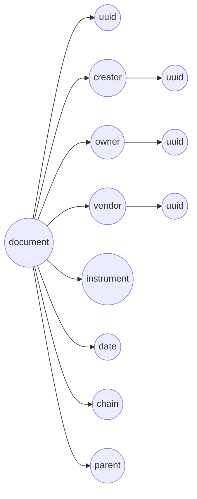
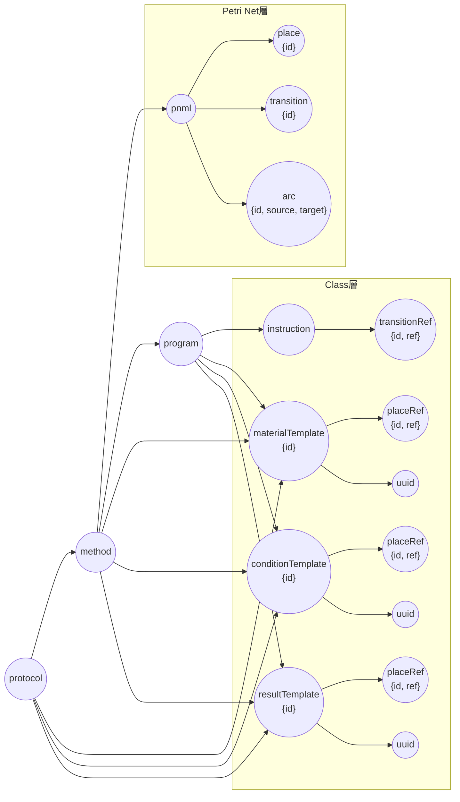
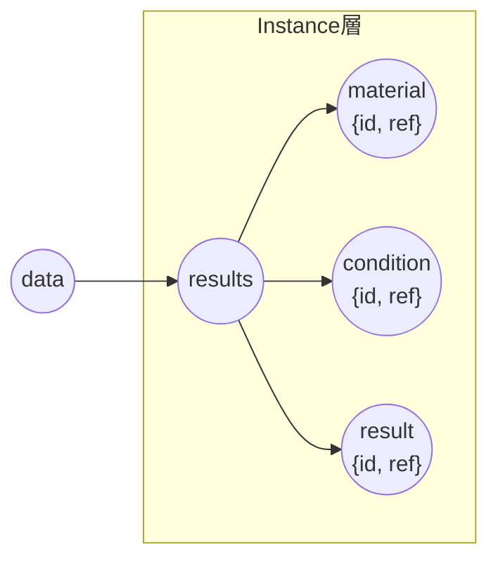
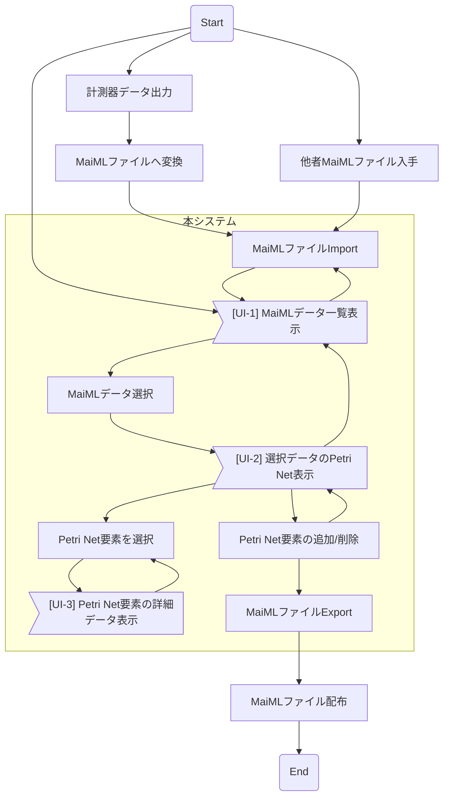

# MaiMLデータの仕様とグラフDBモデリング<!-- omit in toc -->

***

## 1. MaiMLデータとGraph DB構造の対応関係

### 1.1. 概要
MaiMLデータはXMLフォーマットに準拠していため、下記の規約に基づいてXMLデータ構造をGraph DBへ対応させて格納することとする。

* XMLファイル1つにつき `:XMAIL` ノード1つが対応
* `:XMAIL` ノードのプロパティ `file` にXMLファイル自体のパス名等を格納し、外部ストレージにより管理
* XMLタグ1つにつき `:XMLtag` ノード1つが対応
* `:XMAIL` ノードを起点としてXML階層構造の最上位タグへリンク(`:XML_Root`)
* XML階層構造にあわせてXMLタグノード間をリンク(`:XML_Child`)
* XMLタグ名　→プロパティ `__tag` に格納
* XML属性値　→属性名のプロパティに格納  （注: 前項 `__tag` については属性から除外して扱う必要あり）
* XMLテキストデータ　→`:XMLdata`ノードのプロパティ `value`に格納し、所属するXMLタグからリンク(`:XML_Data`)


### 1.2. 例） XMLファイル `sample.xml`
```xml
<?xml version="1.0" encoding="utf-8"?>
<a aa="11" aa2="123">
  <b>aaa</b>
  <c cc="321">
    <b>ccc</b>
  </c>
</a>
```
### 1.3. 上記MaiMLソースのGraph DB変換結果



## 2. MaiMLデータ仕様

### 2.1. 任意のタグ以下の共通構造


### 2.2. XML最上位階層の基本構造


### 2.3. \<document\> 以下の構造


### 2.4. \<protocol\> 以下の構造
* \<pnml\>以下にPetri Net構造の情報をもつ（Petri net層）
* \<pnml\>以下のそれぞれのタグが Petri Net を構成する1要素を表わし、それぞれ`id`をもつ
* \<arc\>タグの接続先要素の`id`を `source`, `target`に格納
* 各\<place\>のデータ構造情報は \<protocol\>以下の階層内 \<materialTemplate\>, \<conditionTemplate\>, \<resultTemplate\> に格納（Class層）
* 各Template情報に対応する\<place\>は、\<placeRef\>の`ref`に格納された`id`で示す
* 各\<transition\>のデータ構造情報は同様に\<instruction\>に格納、対応する\<transition\>は\<transitionRef\>の`ref`で示す



### 2.5. \<data\> 以下の構造
* Instance層はClass層のデータ構造定義が示す具体的なデータを保持する
* \<results\>以下 \<material\>, \<condition\>, \<result\> がそれぞれClass層のTemplateに対応




## 3. システム利用者のワークフロー



## 4. UI表示データ取得手順

### 4.1. [UI-1] MaiMLデータ一覧

xmail_list.cypher :
```
// 存在するMaiMLのリスト取得
match (a:XMAIL)-[:XML_Root]->(d)-[:XML_Child]->(do {__tag: 'document'})
  optional match (do)-[:XML_Child]->(uu {__tag: 'uuid'})-[:XML_Data]->(uud)
  optional match (do)-[:XML_Child]->(na {__tag: 'name'})-[:XML_Data]->(nad)
  optional match (do)-[:XML_Child]->(de {__tag: 'description'})-[:XML_Data]->(ded)
  optional match (do)-[:XML_Child]->(cr {__tag: 'creator'})
  optional match (do)-[:XML_Child]->(ve {__tag: 'vendor'})
  optional match (do)-[:XML_Child]->(ow {__tag: 'ow'})
  optional match (cr)-[:XML_Child]->(crna {__tag: 'name'})-[:XML_Data]->(crnad)
  optional match (cr)-[:XML_Child]->(crde {__tag: 'description'})-[:XML_Data]->(crded)
  optional match (ve)-[:XML_Child]->(vena {__tag: 'name'})-[:XML_Data]->(venad)
  optional match (ve)-[:XML_Child]->(vede {__tag: 'description'})-[:XML_Data]->(veded)
  optional match (ow)-[:XML_Child]->(owna {__tag: 'name'})-[:XML_Data]->(ownad)
  optional match (ow)-[:XML_Child]->(owde {__tag: 'description'})-[:XML_Data]->(owded)
return
    id(a),a.file,uud.value,
    nad.value,ded.value,
    crnad.value,crded.value,
    venad.value,veded.value,
    ownad.value,owded.value ;
```

＜出力データ項目＞
| 項目名 | MaiML規約 | 備考 |
|:--|:--:|:--|
|MaiML node ID|-|Neo4j仕様|
|ファイル名|-|方針としてファイル名での区別は不要
|MaiML uuid|must|Universally Unique Identifier
|MaiML name|must|名前
|MaiML description|must|説明
|Creator uuid|must
|Creator name|must|計測・分析機器
|Creator description|must
|Vendor uuid|must
|Vendor name|must|計測・分析機器メーカ
|Vendor description|must
|Owner uuid|must
|Owner name|must|データの作成者
|Owner description|must
|...||TBD


### 4.2. [UI-2] Petri-Net構成要素
Petri-Netの形状情報を構成する3要素 place, transition, arc を取得する。
*'xmail_getPN.cypher'* :
```
// 指定IDのMaiML内の全てのPN要素(place, transition, arc)を取得
match (a:XMAIL)
  -[:XML_Root]->(d)
  -[:XML_Child]->(pr {__tag: 'protocol'})
  -[:XML_Child]->(me {__tag: 'method'})
  -[:XML_Child]->(pg {__tag: 'program'})
  -[:XML_Child]->(pn {__tag: 'pnml'})
  where id(a)=0
  optional match (pn)-[:XML_Child]->(n)
return
    id(a),a.file,
    id(n),n.__tag,n.id,n.source,n.target;
```

Petri-Netの各arcについて接続先を取得する。
*'xmail_getPNarc.cypher'* :
```
// 指定IDのMaiML内のarc接続情報を抽出
match (a:XMAIL)
  -[:XML_Root]->(d)
  -[:XML_Child]->(pr {__tag: 'protocol'})
  -[:XML_Child]->(me {__tag: 'method'})
  -[:XML_Child]->(pg {__tag: 'program'})
  -[:XML_Child]->(pn {__tag: 'pnml'}),
  (pn)-[:XML_Child]->(ar {__tag: 'arc'})
where id(a)=0
optional match
  (pn)-[:XML_Child]->(s),
  (pn)-[:XML_Child]->(t)
where
  ar.source=s.id
  and ar.target=t.id
return
    id(a),a.file,
    id(ar),id(s),s.id,id(t),t.id;
```

### 4.3. [UI-3] Petri-Net各placeノードの詳細情報
*'xmail_getPlaceInfo.cypher'* :
```
// 指定IDのMaiML内の全てのplaceと関連情報を抽出
match (a:XMAIL)
  -[:XML_Root]->(d)
  -[:XML_Child]->(pr {__tag: 'protocol'})
  -[:XML_Child]->(me {__tag: 'method'})
  -[:XML_Child]->(pg {__tag: 'program'})
  -[:XML_Child]->(pn {__tag: 'pnml'})
  -[:XML_Child]->(pl {__tag: 'place'})
where id(a)=0
optional match
  (pr)-[:XML_Child*]->(te)-[:XML_Child]->(plR {__tag: 'placeRef'})
where plR.ref = pl.id
optional match
  (te)-[:XML_Child]->(uu {__tag: 'uuid'})-[:XML_Data]->(uud),
  (te)-[:XML_Child]->(na {__tag: 'name'})-[:XML_Data]->(nad),
  (te)-[:XML_Child]->(de {__tag: 'description'})-[:XML_Data]->(ded)
return
    id(a),a.file,
    id(pl),pl.id,
    id(plR),plR.id,id(te),te.__tag,te.id,
    uud.value,nad.value,ded.value;
```

＜出力データ項目＞
| 項目名 | MaiML規約 | 備考 |
|:--|:--:|:--|
|MaiML node ID|-|Neo4j仕様|
|ファイル名|-|方針としてファイル名での区別は不要
|place node ID|-|Neo4j仕様
|place MaiML ID|must|MaiML内部ID
|placeRef node ID|-|Neo4j仕様
|placeRef MaiML ID|must|MaiML内部ID
|template node ID|-|Neo4j仕様
|template node tag|must|MaiMLタグ
|template MaiML ID|must|MaiML内部ID
|template MaiML uuid|must|UUID
|template MaiML name|must|名前
|template MaiML description|must|説明
|data MaiML|?| TBD : *dataノードは複数対応する仕様
|data ...


> Written with [StackEdit](https://stackedit.io/).
